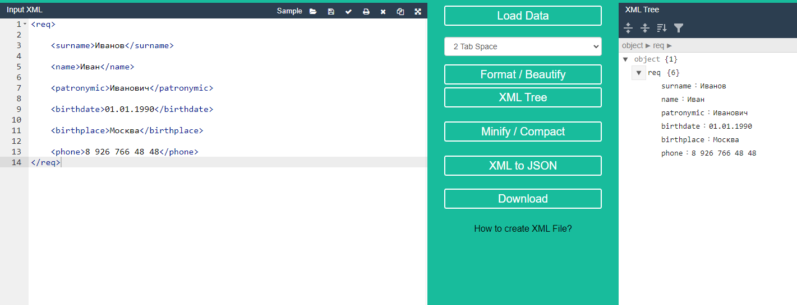

Задача №1: проверить XML на Well formed:

<req>

    <surname>Иванов</surname>

    <name>Иван</name>

    <patronymic>Иванович</patronymic>

    <birthdate>01.01.1990</birthdate>

    <birthplace>Москва</birthplace>

    <phone>8 926 766 48 48</phone>
</req

Задача №2: проверить JSON на Well formed:

{

    "surname": "Иванов"

    "name": "Иван"

    "patronymic": "Иванович"

    "birthdate": "01.01.1990"

    "birthplace": "Москва"

    "phone": "8 926 766 48 48"
}

**Задача №1**:

Первая задача **not well formed** так как в закрывающем теге req **нет закрывающей скобки >**

код XML и его ветви выглядят так:

Для *решения проблемы* достаточно **дописать закрывающую скобку** в теге /req

**Задача №2**:

Вторая задача тоже **not well formed** так как в списке перечисляющем атрибуты **нет запятой** после атрибутов

код JSON и его ветви выглядят так:

Для *решения проблемы* достаточно прописать **запятую после каждого атрибута кроме последнего его объекта**

Таким образом для решения этих задач нужно исправить ошибки в коде, после чего вывод будет отображаться корректно и без ошибок